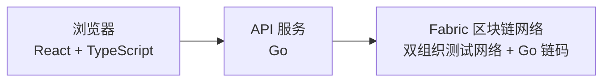

# 迹信

迹信是一个基于 Hyperledger Fabric 区块链的可信物流追踪系统。运单从创建到签收的每一次关键交接——建单、接单、揽收、运输、送达、签收——都会作为一笔交易写入区块链：谁在什么时间做了什么，链上有据可查，任何一方都无法事后单独篡改。

## 系统是怎么工作的

系统分为三层：浏览器端负责操作界面，Go API 负责业务逻辑和登录鉴权，所有业务记录最终由 Fabric 区块链网络上的 Go 智能合约写入账本。



区块链带来的保证：

- 状态只能按规则流转：不能跳过揽收直接签收，也不能重复签收，这些由智能合约强制拒绝。
- 每一次修改都会返回真实的 Fabric 交易 ID，可以在页面的"交易证据"里核对。
- 一次性签收码只展示一次，链上只保存它的摘要，明文不落链。
- 温度越界由智能合约自动判定并记录异常，异常记录不能删除。

## 四种内置角色

| 账号       | 角色   | 能做的事                                     |
| ---------- | ------ | -------------------------------------------- |
| `shipper`  | 发货方 | 创建运单、取消尚未被接单的运单               |
| `carrier`  | 承运方 | 接单、揽收、记录运输节点、处理异常、确认送达 |
| `receiver` | 收货方 | 用一次性签收码确认收货                       |
| `auditor`  | 审计   | 只读查看运单历史和链上交易证据               |

## 环境要求

- Go 1.23+、Node.js 20.12+、pnpm 11
- 正在运行的 Docker 和 `jq`（Fabric 测试网络依赖它们）
  - Windows：Docker Desktop + Git for Windows
  - Linux：Docker Engine（含 compose v2 插件）

装好后先自检一次：

```bash
pnpm doctor
```

## 快速启动

以下命令 Windows 在 PowerShell 中执行，Linux/macOS 在终端中执行。`pnpm` 命令本身在两个平台完全一致，脚本会自动选择对应平台的实现。

### 1. 安装依赖（只需一次）

```bash
pnpm install
```

### 2. 下载 Fabric 组件（只需一次）

```bash
pnpm fabric:bootstrap
```

下载 Fabric 二进制、Docker 镜像和官方测试网络，视网速可能需要几分钟。

### 3. 启动区块链网络（每次使用前）

```bash
pnpm fabric:up
```

这一步会启动双组织测试网络、创建通道 `logisticschannel`、部署链码，并生成 `apps/api/.env.fabric`（内含随机生成的 `JWT_SECRET` 和本机证书路径）。

### 4. 设置账号密码（只需一次）

源代码里没有任何密码，四个账号的密码由你在这一步配置。先生成一个 bcrypt 哈希：

```bash
go run ./apps/api/cmd/hash-password '你的密码'
```

把输出追加到 `apps/api/.env.fabric`，每个账号一行：

```ini
APP_PASSWORD_HASH_SHIPPER=$2a$10$...
APP_PASSWORD_HASH_CARRIER=$2a$10$...
APP_PASSWORD_HASH_RECEIVER=$2a$10$...
APP_PASSWORD_HASH_AUDITOR=$2a$10$...
```

配置一次即可：以后重新执行 `pnpm fabric:up` 时，已写入的 `APP_PASSWORD*` 行会自动保留。本地开发也可以改用明文形式 `APP_PASSWORD_<账号>=明文`，详见 `apps/api/.env.example`。

### 5. 启动应用（每次使用前）

应用通过环境变量 `ENV_FILE` 找到网络配置：

Windows PowerShell：

```powershell
$env:ENV_FILE = (Resolve-Path ".\apps\api\.env.fabric").Path
pnpm dev
```

Linux/macOS：

```bash
export ENV_FILE="$PWD/apps/api/.env.fabric"
pnpm dev
```

启动完成后：

- 打开 <http://localhost:5173> 进入工作台；
- 打开 <http://127.0.0.1:3001/api/network>，确认返回的 `mode` 是 `fabric`、`health.status` 是 `ok`，说明应用已连上真实区块链。

### 6. 写入示例运单（可选）

```bash
pnpm seed
```

写入 12 条覆盖各种状态的运单，全部真实上链。可以重复执行，已存在的会自动跳过。

### 7. 停止网络

```bash
pnpm fabric:down
```

下次启动只需重复第 3、5 步。

## 亲手走一遍完整流程

1. 用 `shipper` 登录，创建一票运单（可设置温控范围），**保存系统返回的 6 位签收码**——它只显示这一次。
2. 换 `carrier` 登录，对这票运单依次接单、揽收、添加运输节点、确认送达。中途可以故意录一个越界温度，看看异常如何被记录和处理。
3. 换 `receiver` 登录，先用错误的签收码试一次（会被拒绝），再用正确的签收码完成签收。
4. 退出登录，在公开查询页输入运单号，查看脱敏后的轨迹、最终状态和交易证据。

## 常用命令

| 命令                                                 | 作用                                         |
| ---------------------------------------------------- | -------------------------------------------- |
| `pnpm doctor`                                        | 检查本机环境是否齐全                         |
| `pnpm fabric:bootstrap`                              | 首次下载 Fabric 组件                         |
| `pnpm fabric:up` / `pnpm fabric:down`                | 启动 / 停止区块链网络                        |
| `pnpm dev`                                           | 同时启动前端（5173 端口）和 API（3001 端口） |
| `pnpm seed`                                          | 写入示例运单                                 |
| `pnpm build`                                         | 构建前端、API 和链码                         |
| `pnpm test`                                          | 运行全部测试                                 |
| `pnpm typecheck` / `pnpm lint` / `pnpm format:check` | 类型、静态和格式检查                         |

## 测试说明

- `pnpm test` 和 `pnpm test:closed-loop` 使用文件型测试替身模拟链上状态机，**不需要 Docker**，随时能跑。
- `pnpm test:fabric` 会在运行中的测试网络上执行一遍真实的"建单到签收"链上闭环；Docker 没开时自动跳过，不影响 CI。

## 目录结构

```text
apps/web             React 前端（业务工作台 + 公开查询页）
apps/api             Go API：登录鉴权、业务接口、Fabric Gateway 适配器
packages/shared      前端使用的 TypeScript 类型
chaincode/logistics  Go 智能合约（运单状态机）
network              Fabric 测试网络的启动、部署与环境生成脚本
scripts              环境自检、格式检查等辅助脚本
deploy               生产部署示例（Nginx 配置、上线核对清单）
docs                 设计方案、验收记录、迁移指南
```

Go 代码位于 `go.work` 工作区；API 和链码各有独立的 `go.mod`，因此链码目录可以被 Fabric 单独打包。

## 更多文档

- [设计方案](docs/设计方案.md)：业务架构与运单状态机
- [Go 重构审查报告](docs/Go重构审查报告.md)：代码结构与各文件职责
- [验收记录](docs/验收记录.md)：真实链上闭环的验证证据
- [Ubuntu 虚拟机部署指南](docs/Ubuntu虚拟机部署指南.md)、[Linux 迁移清单](docs/Linux迁移清单.md)：Linux 环境部署
- [deploy/README.md](deploy/README.md)：生产部署示例

## 两个重要提醒

- `apps/api/.env.fabric` 含本机证书和私钥路径，已被 Git 忽略，**不要提交**。
- 当前使用的是 Fabric 官方测试网络，面向开发和演示，**不是生产网络模板**。
