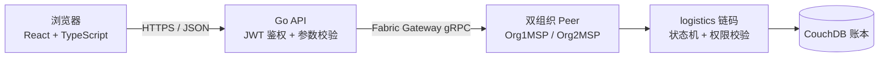

# 迹信

迹信是一个基于 Hyperledger Fabric 区块链的可信物流追踪系统。运单从创建到签收的每一次关键交接——建单、接单、揽收、运输、异常、送达、签收——都是一笔真实的 Fabric 交易：谁在什么时间做了什么，链上有据可查，任何一方都无法事后单独篡改。

## 整体工作原理

系统分三层，职责边界清晰：

| 层         | 技术               | 职责                                                   |
| ---------- | ------------------ | ------------------------------------------------------ |
| 浏览器端   | React + TypeScript | 操作界面、公开查询页；不持有任何业务规则               |
| API 服务   | Go 标准库 HTTP     | 登录鉴权（JWT）、参数校验、角色控制、调用区块链        |
| 区块链网络 | Hyperledger Fabric | 智能合约执行业务规则，账本保存全部运单与事件，不可篡改 |



一笔"承运方录入运输节点"请求的完整旅程：

1. 浏览器携带登录时获得的 httpOnly cookie 调用 `POST /api/shipments/:id/actions/checkpoint`。
2. Go API 校验 JWT 身份和请求参数（字段长度、温度格式、未知字段一律拒绝），确认该角色可以执行该动作。
3. API 通过 Fabric Gateway，用当前登录角色对应的组织身份（发货方走 Org1MSP，承运方走 Org2MSP）向 Peer 提交交易。
4. 链码 `logistics` 在链上再次校验：调用者 MSP 是否有权、运单当前状态是否允许该动作（比如未揽收就不能签收）、温度是否越界。
5. 校验通过后写入世界状态并追加事件，交易在双组织背书后正式上链。
6. API 收到回执，把 **Fabric 交易 ID、账本时间、更新后的运单**返回给浏览器，页面在"交易证据"中展示，可供核对。

查询类请求（列表、详情、历史、公开查询）同样经由 Gateway 读链，页面看到的所有状态都来自账本，API 不做自己的数据库。

## 区块链用在哪里

智能合约 `chaincode/logistics` 是业务规则的唯一裁决者：

- **状态机强制流转**：`CREATED → ACCEPTED → PICKED_UP → IN_TRANSIT → DELIVERED → RECEIVED`，跳步、重复签收、越权操作在链上直接拒绝，与应用层校验形成双保险。
- **组织即权限**：链码校验调用者 MSP——发货侧动作只有 Org1MSP 能提交，承运侧动作只有 Org2MSP 能提交，伪造前端请求也无法越权。
- **可信时间与责任链**：每个事件记录提交者身份、MSP、Fabric 交易时间戳和交易 ID，不信任浏览器自报时间。
- **隐私不上链**：签收码、送达凭证等原文永不落链，链上只存 SHA-256 摘要；签收时由链码计算摘要比对，验真时重新计算原文件摘要即可判断是否与存证一致。
- **异常自动存证**：运单设定温控范围后，节点温度越界由链码自动判定并写入异常事件，异常记录不可删除。
- **公开可核验**：公开查询页返回脱敏轨迹和交易 ID，任何人可用运单号核对，无需登录。

## 四种内置角色

| 账号       | 角色   | 能做的事                                     |
| ---------- | ------ | -------------------------------------------- |
| `shipper`  | 发货方 | 创建运单、取消尚未被接单的运单               |
| `carrier`  | 承运方 | 接单、揽收、记录运输节点、处理异常、确认送达 |
| `receiver` | 收货方 | 用一次性签收码确认收货                       |
| `auditor`  | 审计   | 只读查看运单历史和链上交易证据               |

## 环境要求

- Go 1.23+、Node.js 20.12+、pnpm 11
- 正在运行的 Docker 和 `jq`（Fabric 测试网络依赖它们）
  - Windows：Docker Desktop + Git for Windows
  - Linux：Docker Engine（含 compose v2 插件）

## 快速启动

以下命令 Windows 在 PowerShell 中执行，Linux/macOS 在终端中执行。`pnpm` 命令在两个平台完全一致，脚本会自动选择对应平台的实现。

### 1. 安装依赖（只需一次）

```bash
pnpm install
```

### 2. 下载 Fabric 组件（只需一次）

```bash
pnpm fabric:bootstrap
```

下载 Fabric 二进制、Docker 镜像和官方测试网络，视网速可能需要几分钟。

### 3. 启动区块链网络（每次使用前）

```bash
pnpm fabric:up
```

这一步会启动双组织测试网络、创建通道 `logisticschannel`、部署链码，并生成 `apps/api/.env.fabric`（内含随机生成的 `JWT_SECRET` 和本机证书路径）。

### 4. 设置账号密码（只需一次）

源代码里没有任何密码，四个账号的密码由你在这一步配置。先生成一个 bcrypt 哈希：

```bash
go run ./apps/api/cmd/hash-password '你的密码'
```

把输出追加到 `apps/api/.env.fabric`，每个账号一行：

```ini
APP_PASSWORD_HASH_SHIPPER=$2a$10$...
APP_PASSWORD_HASH_CARRIER=$2a$10$...
APP_PASSWORD_HASH_RECEIVER=$2a$10$...
APP_PASSWORD_HASH_AUDITOR=$2a$10$...
```

配置一次即可：以后重新执行 `pnpm fabric:up` 时，已写入的 `APP_PASSWORD*` 行会自动保留。本地开发也可以改用明文形式 `APP_PASSWORD_<账号>=明文`，详见 `apps/api/.env.example`。

### 5. 启动应用（每次使用前）

应用通过环境变量 `ENV_FILE` 找到网络配置：

Windows PowerShell：

```powershell
$env:ENV_FILE = (Resolve-Path ".\apps\api\.env.fabric").Path
pnpm dev
```

Linux/macOS：

```bash
export ENV_FILE="$PWD/apps/api/.env.fabric"
pnpm dev
```

启动完成后：

- 打开 <http://localhost:5173> 进入工作台；
- 打开 <http://127.0.0.1:3001/api/network>，确认返回的 `mode` 是 `fabric`、`health.status` 是 `ok`，说明应用已连上真实区块链。

### 6. 写入示例运单（可选）

```bash
pnpm seed
```

写入 12 条覆盖各种状态的运单，全部真实上链。可以重复执行，已存在的会自动跳过。

### 7. 停止网络

```bash
pnpm fabric:down
```

下次启动只需重复第 3、5 步。

## 亲手走一遍完整流程

1. 用 `shipper` 登录，创建一票运单（可设置温控范围），**保存系统返回的 6 位签收码**——它只显示这一次。
2. 换 `carrier` 登录，对这票运单依次接单、揽收、添加运输节点、确认送达。中途可以故意录一个越界温度，看看异常如何被记录和处理。
3. 换 `receiver` 登录，先用错误的签收码试一次（会被拒绝），再用正确的签收码完成签收。
4. 退出登录，在公开查询页输入运单号，查看脱敏后的轨迹、最终状态和交易证据。

## 常用命令

| 命令                                                 | 作用                                         |
| ---------------------------------------------------- | -------------------------------------------- |
| `pnpm fabric:bootstrap`                              | 首次下载 Fabric 组件                         |
| `pnpm fabric:up` / `pnpm fabric:down`                | 启动 / 停止区块链网络                        |
| `pnpm dev`                                           | 同时启动前端（5173 端口）和 API（3001 端口） |
| `pnpm seed`                                          | 写入示例运单                                 |
| `pnpm build`                                         | 构建前端、API 和链码                         |
| `pnpm test`                                          | 运行全部测试                                 |
| `pnpm typecheck` / `pnpm lint` / `pnpm format:check` | 类型、静态和格式检查                         |

## 测试说明

- `pnpm test` 和 `pnpm test:closed-loop` 使用文件型测试替身模拟链上状态机，**不需要 Docker**，随时能跑。
- `pnpm test:fabric` 会在运行中的测试网络上执行一遍真实的"建单到签收"链上闭环；Docker 没开时自动跳过，不影响 CI。

## 目录结构

```text
blockchain
├── apps
│   ├── api                  Go API 服务
│   │   ├── cmd/             程序入口：server 主服务、seed 示例数据、hash-password 密码工具
│   │   └── internal/        业务代码（Go 约定：internal 不对外暴露）
│   │       ├── auth/        JWT 签发与校验
│   │       ├── config/      环境变量加载（密码、Fabric 连接配置）
│   │       ├── httpapi/     HTTP 路由、请求校验、业务接口
│   │       ├── ledger/      账本适配层：fabric.go 真实上链，fake/ 供测试
│   │       ├── users/       四个内置角色账号
│   │       └── apperror/    统一错误码
│   └── web                  React 前端
│       └── src/
│           ├── pages/       工作台、运单列表/详情、创建运单、登录、公开查询
│           ├── components/  时间线、路线图、证据条、对话框等业务组件
│           ├── lib/         API 客户端、脱敏展示、路线地理数据、动效
│           ├── styles/      设计令牌与全局样式
│           └── auth/        登录会话上下文
├── chaincode/logistics      Go 智能合约（运单状态机，可独立打包部署）
├── packages/shared          前端使用的 TypeScript 类型
├── network                  Fabric 测试网络的下载、启动、部署与环境生成脚本
├── scripts                  跨平台任务分发（run-platform.js）与链上闭环测试脚本
├── deploy                   生产部署示例（Nginx 配置、上线核对清单）
└── docs                     设计方案、项目介绍、部署指南、设计系统
```

Go 代码位于 `go.work` 工作区；API 和链码各有独立的 `go.mod`，因此链码目录可以被 Fabric 单独打包。

## 更多文档

- [设计方案](docs/设计方案.md)：业务架构、运单状态机、链上数据与合约接口的完整设计
- [项目介绍](docs/项目介绍.md)：面向答辩与展示的项目综述
- [设计系统](docs/设计系统.md)：界面视觉规范（色彩、字体、网格）
- [Ubuntu 虚拟机部署指南](docs/Ubuntu虚拟机部署指南.md)：单机完整部署
- [deploy/README.md](deploy/README.md)：多机生产拓扑部署示例

## 两个重要提醒

- `apps/api/.env.fabric` 含本机证书和私钥路径，已被 Git 忽略，**不要提交**。
- 当前使用的是 Fabric 官方测试网络，面向开发与教学，**不是生产网络模板**；生产拓扑参见 `deploy/README.md`。
