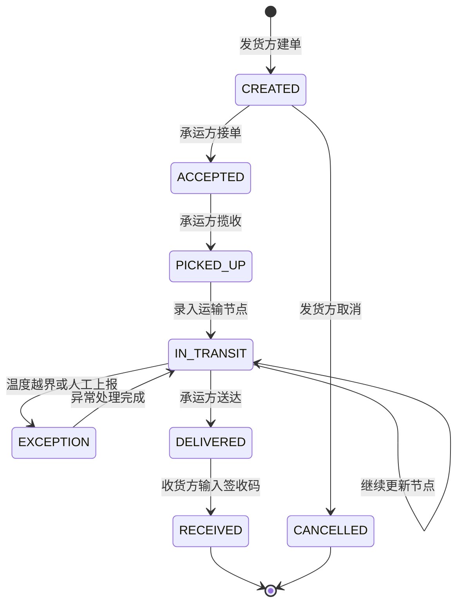
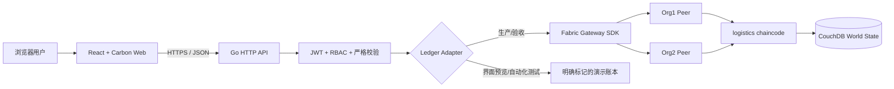

# 迹信 - 基于 Hyperledger Fabric 的可信物流追踪系统设计方案

## 1. 项目定位

迹信面向中小物流协作场景，解决货物在发货方、承运方、网点和收货方之间流转时，轨迹记录可被单方修改、交接责任难界定、异常证据分散、收货结果无法形成可信闭环的问题。

项目采用 B/S 架构。浏览器负责业务操作和公开查询，Go 服务负责鉴权、参数校验和 Fabric Gateway 调用，Hyperledger Fabric Go 智能合约负责状态流转、组织权限、关键证据哈希和不可篡改历史。

本项目不把普通数据库记录包装成区块链结果。真实运行时，每次建单、接单、揽收、轨迹更新、异常上报、送达和签收都必须提交 Fabric 交易，并返回交易 ID。无 Fabric 环境时可启用演示账本预览界面，但页面会明确标记“演示账本”，不能作为真实上链证明。

## 2. 课程要求映射

| 课程要求                    | 设计响应                                                 | 验收证据                                   |
| --------------------------- | -------------------------------------------------------- | ------------------------------------------ |
| B/S 应用                    | React 浏览器端 + Go HTTP API                             | 本机浏览器可访问，接口可独立测试           |
| 必须使用 Hyperledger Fabric | Fabric Gateway SDK + Fabric 智能合约 + 双组织测试网络    | 交易 ID、MSP、区块时间、链码事件和历史查询 |
| 提交完整源码                | `apps/web`、`apps/api`、`chaincode/logistics`、`network` | 前端、后端、SDK、智能合约和网络脚本齐全    |
| 功能完整                    | 七段业务状态和角色动作矩阵                               | 自动化闭环测试覆盖建单到签收               |
| 界面美观                    | IBM Carbon 组件体系，森林绿品牌令牌与纸张灰白画布        | 桌面和移动端浏览器视觉验收                 |
| 实用价值                    | 交接留痕、异常证据、公开验真、隐私脱敏                   | 公开运单查询和证据核验页                   |
| 创新性                      | 交接责任链、温控异常、签收码哈希、证据摘要               | 异常自动判定、哈希比对和完整性结论         |

答辩 PPT 和演示视频由使用者自行制作，项目仅提供可演示的软件、设计文档和运行说明。

## 3. 用户与权限

| 角色     | Fabric 组织      | 主要能力                                      |
| -------- | ---------------- | --------------------------------------------- |
| 发货方   | Org1MSP          | 创建运单、查看运单、取消未接单运单            |
| 承运方   | Org2MSP          | 接单、揽收、更新节点、上报/解除异常、标记送达 |
| 收货方   | Org1MSP 网关代理 | 查询本人运单，使用一次性签收码确认收货        |
| 审计访客 | 只读             | 通过运单号查看脱敏轨迹，核验交易证据          |

应用层 JWT 决定用户可见功能，智能合约再次依据调用者 MSP 和当前状态校验动作。关键权限不能只依赖前端按钮隐藏。

## 4. 业务闭环

闭环验收步骤：

1. 发货方创建运单，系统生成业务运单号和一次性签收码，只保存签收码 SHA-256 摘要到链上。
2. 承运方接单并揽收，每一步由 Org2MSP 身份提交交易。
3. 承运方录入途中节点、运输备注和可选温度。超出设定温区时智能合约记录异常。
4. 异常处理后恢复运输，后续节点保留原异常证据，不能删除。
5. 承运方上传送达凭证摘要并标记送达。
6. 收货方输入签收码。智能合约比对摘要后将状态改为已签收，签收码不可重复使用。
7. 审计访客输入运单号，查看脱敏时间线、交易 ID、提交组织和完整性核验结论。

## 5. 技术架构

### 技术选型

- 前端：React、TypeScript、Vite、React Router、IBM Carbon、Phosphor 不再额外混用图标库。
- 后端：Go 标准库 HTTP、HMAC-SHA256 JWT、Hyperledger Fabric Gateway Go SDK。
- 智能合约：Go、`fabric-contract-api-go`。
- 区块链网络：Hyperledger Fabric 双组织、单通道、Raft orderer、CouchDB 状态库。
- 测试：Go `testing`/`httptest`、Vitest、Testing Library、Playwright。

## 6. 链上数据设计

### Shipment 聚合

| 字段                      | 说明                       |
| ------------------------- | -------------------------- |
| `id`                      | 不可变业务主键             |
| `trackingNumber`          | 公开查询号，链上唯一       |
| `status`                  | 当前状态                   |
| `shipper` / `carrier`     | 参与方名称和 MSP 标识      |
| `origin` / `destination`  | 起止地                     |
| `goods`                   | 货物名称、类别、件数、重量 |
| `recipientMasked`         | 脱敏收货人和手机号         |
| `temperatureRange`        | 可选温控上下限             |
| `deliveryCodeHash`        | 一次性签收码 SHA-256 摘要  |
| `documentHash`            | 发货资料摘要               |
| `events`                  | 有序业务事件数组           |
| `anomalyCount`            | 异常累计次数               |
| `createdAt` / `updatedAt` | Fabric 交易时间            |

### 业务事件

每个事件包含 `sequence`、`type`、`location`、`description`、`actorId`、`mspId`、`txId`、`timestamp`、可选温度和证据摘要。时间使用交易上下文时间，不接受浏览器自报时间作为可信时间。

### 隐私边界

- 链上只保存脱敏手机号、必要业务字段和文件 SHA-256 摘要。
- 原始图片、身份证明和完整联系方式不写入区块链。
- 公开查询接口返回脱敏视图，不返回签收码摘要和内部备注。

## 7. 智能合约接口

| 交易                 | 调用方       | 前置状态               | 结果                                   |
| -------------------- | ------------ | ---------------------- | -------------------------------------- |
| `CreateShipment`     | Org1MSP      | 运单不存在             | 创建 `CREATED` 运单                    |
| `AcceptShipment`     | Org2MSP      | `CREATED`              | 进入 `ACCEPTED`                        |
| `PickupShipment`     | Org2MSP      | `ACCEPTED`             | 进入 `PICKED_UP`                       |
| `AddCheckpoint`      | Org2MSP      | `PICKED_UP/IN_TRANSIT` | 新增节点，进入 `IN_TRANSIT` 或自动异常 |
| `ReportException`    | Org2MSP      | 运输中                 | 进入 `EXCEPTION`                       |
| `ResolveException`   | Org2MSP      | `EXCEPTION`            | 回到 `IN_TRANSIT`                      |
| `MarkDelivered`      | Org2MSP      | `IN_TRANSIT`           | 进入 `DELIVERED`                       |
| `ConfirmReceipt`     | Org1MSP      | `DELIVERED`            | 校验签收码后进入 `RECEIVED`            |
| `CancelShipment`     | Org1MSP      | `CREATED`              | 进入 `CANCELLED`                       |
| `ReadShipment`       | 任意通道成员 | 运单存在               | 返回当前状态                           |
| `GetShipmentHistory` | 任意通道成员 | 运单存在               | 返回键历史和交易元数据                 |
| `GetAllShipments`    | 任意通道成员 | 无                     | 返回运单集合                           |

所有修改交易发出统一 `ShipmentEvent` 链码事件，供后端日志或后续通知模块订阅。

## 8. API 设计

### 身份接口

- `POST /api/auth/login`
- `GET /api/auth/me`

### 业务接口

- `GET /api/dashboard/summary`
- `GET /api/shipments`
- `POST /api/shipments`
- `GET /api/shipments/:id`
- `GET /api/shipments/:id/history`
- `POST /api/shipments/:id/actions/accept`
- `POST /api/shipments/:id/actions/pickup`
- `POST /api/shipments/:id/actions/checkpoint`
- `POST /api/shipments/:id/actions/exception`
- `POST /api/shipments/:id/actions/resolve`
- `POST /api/shipments/:id/actions/deliver`
- `POST /api/shipments/:id/actions/confirm`
- `POST /api/shipments/:id/actions/cancel`

### 公开验真接口

- `GET /api/public/track/:trackingNumber`
- `GET /api/public/track/:trackingNumber/history`
- `POST /api/public/verify`

每个修改响应都返回 `transactionId`、`ledgerMode`、`committedAt` 和更新后的运单。

## 9. 页面与交互

| 页面     | 关键内容                                          |
| -------- | ------------------------------------------------- |
| 登录     | 角色说明、演示账号、网络模式提示、错误和加载状态  |
| 工作台   | 按状态汇总、待处理动作、最近运单、网络健康状态    |
| 运单列表 | 搜索、状态筛选、角色相关操作入口、空状态          |
| 创建运单 | 货物、收发地址、温控、收货信息、签收码提示        |
| 运单详情 | 状态轨迹、当前责任方、可执行动作、异常和温度信息  |
| 交易证据 | 交易 ID、MSP、时间、证据哈希、复制操作            |
| 公开查询 | 无需登录，运单号查询、脱敏轨迹、链上/演示模式标记 |
| 验真结果 | 哈希匹配结果、历史连续性、最终状态和风险提示      |

界面规则：使用一个森林绿强调色，业务表面 8px 圆角，控件 4px 圆角，状态标签使用胶囊几何，数字和交易 ID 使用等宽字体。状态颜色只表达真实语义，不作为装饰。公开叙事标题使用 `Noto Serif SC Variable` 衬线体形成档案编辑感，正文与后台使用 `Manrope Variable` + `Noto Sans SC Variable`。支持 360px 以上移动端、键盘导航、可见焦点、骨架加载、空状态和错误恢复。视觉规范详见根目录 `DESIGN.md`。

## 10. 安全与可靠性

- API 使用严格 JSON 解码和字段级校验拒绝未知字段、非法状态和超长输入。
- JWT 设置有效期，密钥只通过环境变量提供；浏览器会话由 httpOnly + SameSite cookie 承载（生产环境附加 Secure），前端不再把 token 写入 localStorage。`Authorization: Bearer` 仍对非浏览器客户端开放。
- 演示账号密码在开发和课程演示中保留内置值；部署可用 `DEMO_PASSWORD_<账号>` 覆盖为环境变量，或用 `DEMO_PASSWORD_HASH_<账号>` 配置 bcrypt 哈希（生产环境必须配置其一），哈希可用 `go run ./apps/api/cmd/hash-password` 生成。
- 服务端角色校验与链码 MSP 校验双重执行。
- 交易时间来自 Fabric，不信任浏览器时间。
- 签收码使用 SHA-256 摘要，链上不保存明文。
- 同一动作在错误状态下重复调用会失败，避免重复揽收和重复签收。
- 公开接口只返回脱敏数据，并对查询频率预留限流配置。
- 演示模式在 API 和页面都显式标识，避免把模拟交易误认为真实上链。

## 11. 运行方案

### 快速预览

安装依赖后使用演示账本启动前后端，可完整走通业务界面和状态机。该模式用于没有 Docker 的开发机和自动化测试。

### Fabric 验收

网络脚本基于官方 `fabric-samples/test-network` 启动双组织网络、创建 `logisticschannel`、部署本项目智能合约并准备 Org1/Org2 Gateway 身份。随后将 `LEDGER_MODE` 设为 `fabric`，API 的所有修改请求通过 Fabric Gateway 提交。

## 12. 完成定义

只有同时满足以下条件才视为开发完毕：

- 前端、后端、智能合约和 SDK 可构建。
- 智能合约状态流转和权限测试通过。
- API 闭环测试从创建运单运行到收货确认。
- 浏览器可完成同一闭环，桌面端和移动端无阻塞缺陷。
- 演示模式和 Fabric 模式标识清晰。
- Fabric 环境具备时，真实网络部署和交易回执验证通过。
- README 提供从零启动、演示账号、常见故障和提交目录说明。

是否完成真实 Fabric 容器网络验收，以最新 `docs/验收记录.md` 为准。2026-07-29 的验收已覆盖新 Go 链码部署、9 笔有效修改交易以及 API 重启后的账本持久化；该结论仅适用于本机测试网络，不外推为生产网络验收。
